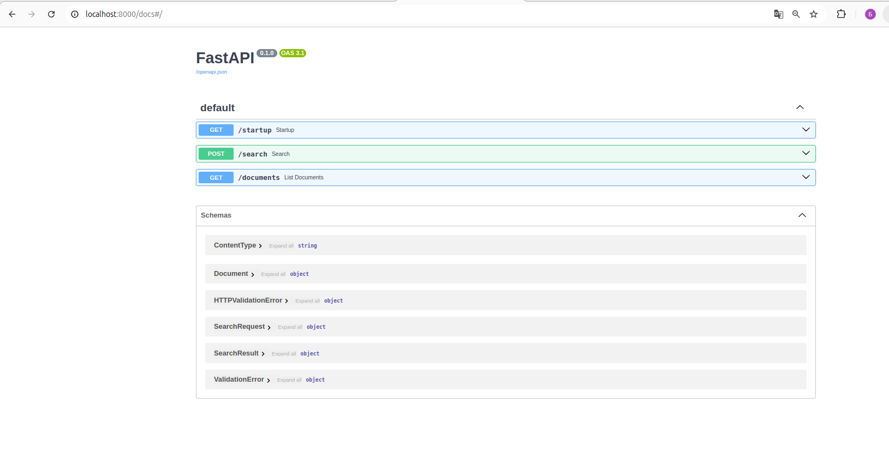
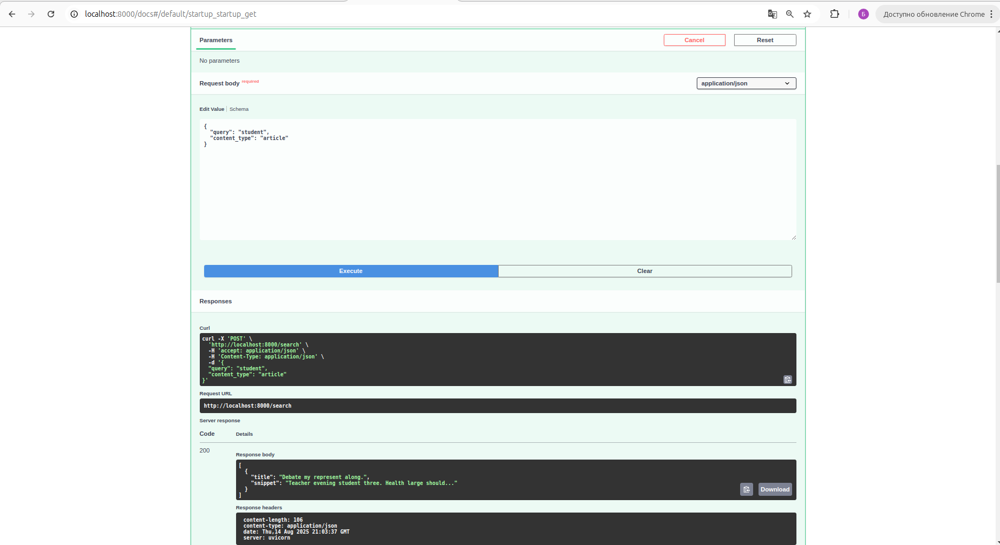
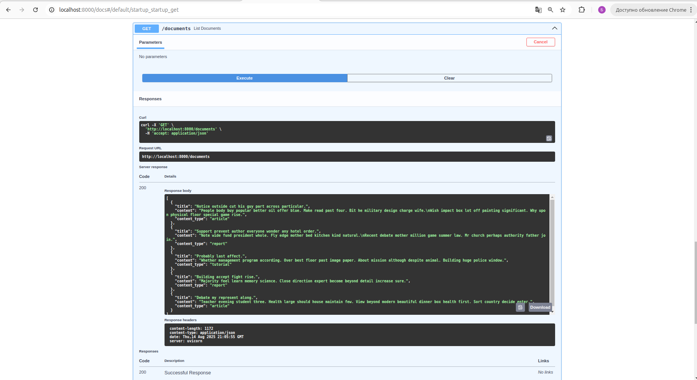

# FastAPI + OpenSearch Integration Project

Проект предоставляет простое веб-приложение на FastAPI с интеграцией OpenSearch для полнотекстового поиска документов.

## 📌 Основные возможности

- Создание индекса в OpenSearch с полями:
  - `title` (текст)
  - `content` (текст)
  - `content_type` (4 варианта: article, news, tutorial, report)
- Генерация тестовых данных
- Поиск по ключевым словам в title и content
- Фильтрация результатов по content_type
- Деплой через Docker Compose

## 🚀 Запуск проекта

### Предварительные требования

- Установленный Docker и Docker Compose
- 4GB+ свободной оперативной памяти (для работы OpenSearch)

### Инструкция по запуску

1. Клонируйте репозиторий:

```bash
git clone https://github.com/bulat-nitaliev/opensearch_simple_task.git
cd opensearch_simple_task
```

2. Запустите сервисы:

```
docker-compose up -d --build
```

3. Дождитесь полного запуска (может занять 2-3 минуты)

4. Проверьте работу сервисов:
   Доступные endpoints

- GET /startup - Генерация тестовых данных
- GET /documents - список всех документов

- POST /search - поиск документов

#




